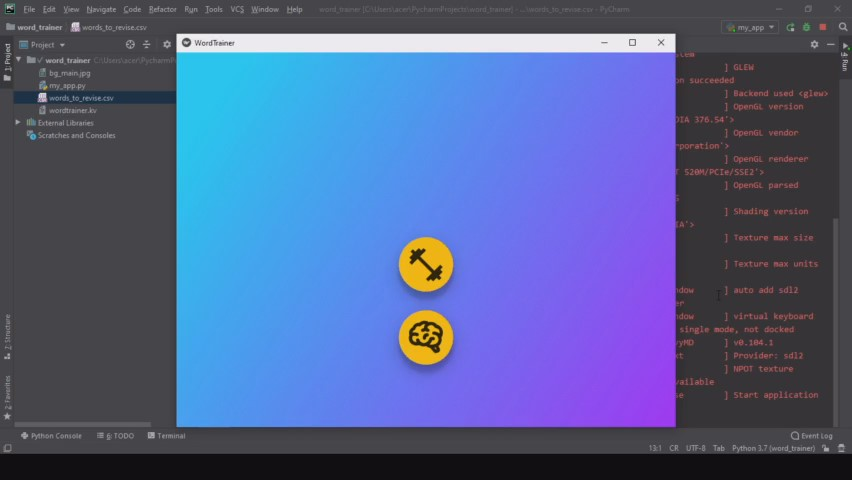

# word_trainer

Kivymd application for spelling practices

  

### Dependencies:

- [Kivy](https://github.com/kivy/kivy) >= 2.0.0 ([Installation](https://kivy.org/doc/stable/gettingstarted/installation.html))
- [Python 3.6+](https://www.python.org/)
- [KivyMD](https://github.com/kivymd/KivyMD) ([Installation](https://kivymd.readthedocs.io/en/latest/getting-started/))

